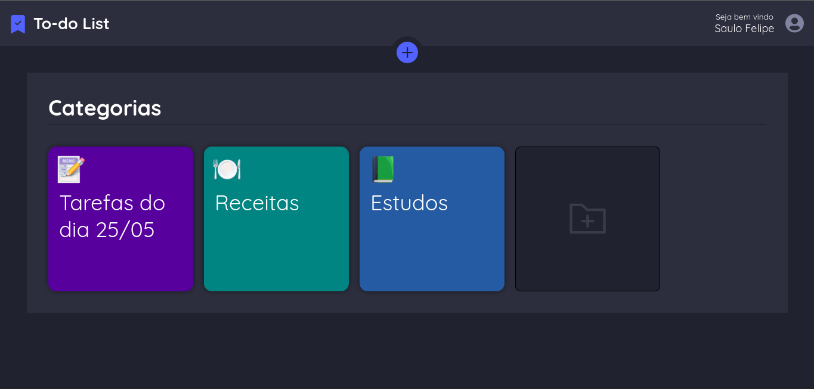
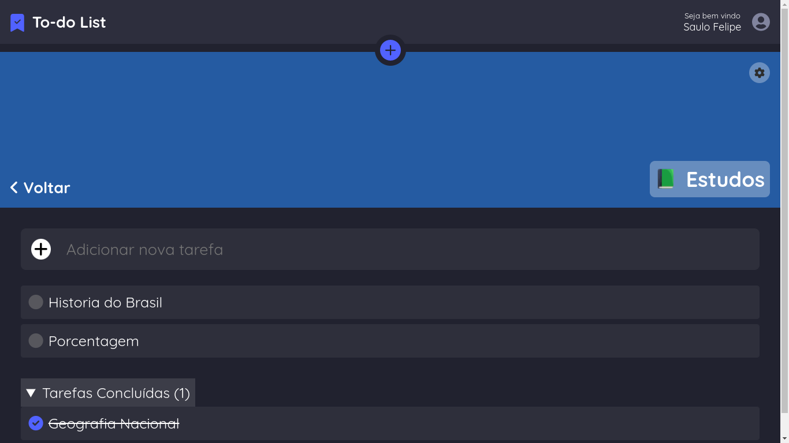
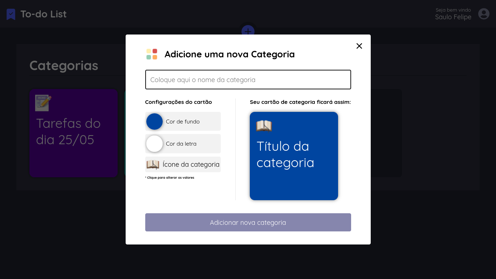
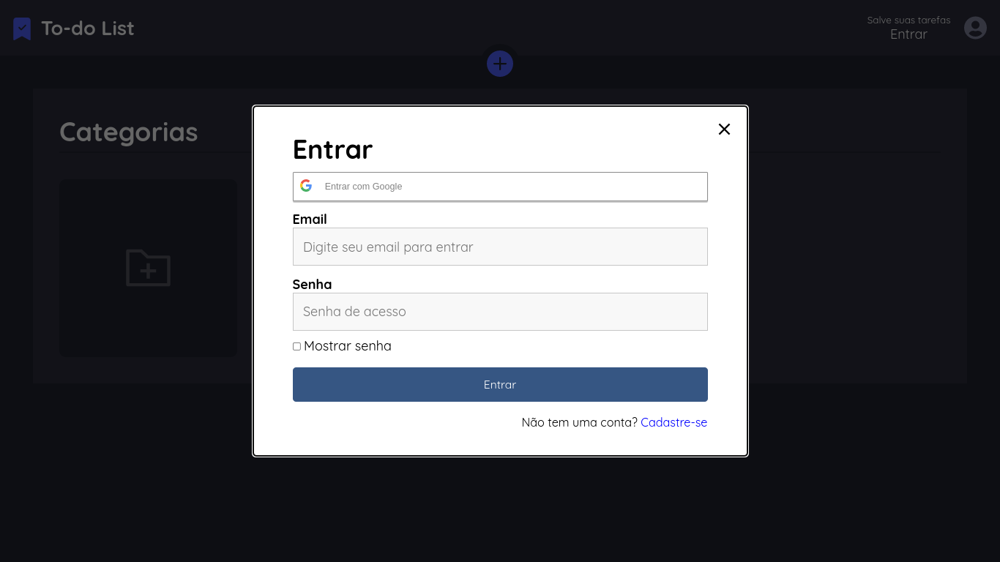
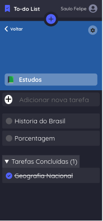
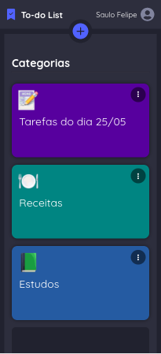

<p align="center">
    
</p>

------------------------------------
## Índice

* [Preview](#preview)
* [Sobre](#sobre)
* [Funcionalidades](#funcionalidades)
* [Layout](#layout)
* [Como Executar](#como-executar)
* [Tecnologias](#tecnologias)
* [Autor](#autor)
* [Licença](#licenca)

------------------------------------

## ✔️ Sobre <a id="sobre"></a>
To-do list criado com React e Nodejs. Use esse web app para salvar suas tarefas localmente ou em nuvem.
<br>

------------------------------------

## 🚀 Preview <a id="preview"></a>

-> https://todolist-frontend-liart.vercel.app/categories

------------------------------------
## ⚙️ Funcionalidades <a id="funcionalidades"></a>
1. ✅ Categorias com propriedas personalizaveis
2. ✅ Dinâmico
3. ✅ Renponsivo
4. ✅ Sistema de autenticação simples e eficiente
5. ✅ Salvar dados localmente
6. ✅ Salvar dados na sua conta e acessar em qualquer lugar onde estiver

------------------------------------

## 🎨 Layout <a id="layout"></a>

<a href="https://todolist-frontend-liart.vercel.app/categories"></a>


<p>*O Layout completo do site está disponível <a href="https://todolist-frontend-liart.vercel.app/categories">aqui</a>.</p>






<p align="center">
  
  
</p>

------------------------------------

## 🧩 Como Executar <a id="como-executar"></a>

Para executar o projeto na sua máquina, basta seguir a sequencia de passos:

```
# 1 - Clone o repositorio
# 2 - Baixe as dependencias
# 3 - [backend]$ yarn dev
# 4 - [frontend]$ yarn dev

* O banco de dados está hospedado externamente
```

------------------------------------

## 🤖 Tecnologias <a id="tecnologias"></a>

Neste To-do List, foram utilizadas as seguintes tecnologias: 

* HTML5 
* CSS3 
* Javascript 
* Nodejs 
* React 
* PostgreSQL 
* TypeScript 


------------------------------------

## 👨 Autor <a id="autor"></a>

<p align="center">➡️ Criado e desenvolvido por <strong>eu</strong> mesmo 🧑‍💻.</p>

------------------------------------

## 📜 Licença <a id="licenca"></a>

<p align="center">Todos os direitos reservados ©Copyright - Saulo Felipe</p>
